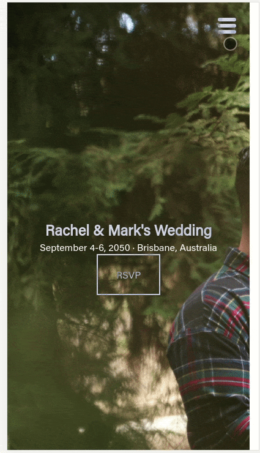

Photo by Tim Johnson on Unsplash

## Introduction

Let me first start off by saying who this tutorial is aimed at. This is not a beginner friendly tutorial, there are a lot of different intermediate and advanced concepts here, and while I'll be trying my best to link to the relevant docs for everything that I use, I don't be deep diving into every technology and programming pattern.

In this tutorial I'm going to walk you through how I built the menu for my wedding registry side project in React.



I this tutorial we use a bunch of React API's including react hooks like `useImperativeHandle`, React.Portal and more, as well as some cool CSS features like `mix-mode-color`.

I'll also be building in TypeScript.

## Let's get started.

In order to build along side you, I'm going to start a new project as well. So let's start with create-react-app.

```bash
npx create-react-app menu-tutorial --template typescript
```

With our stock standard create-react-app project setup, the first thing we'll need to do is add a couple of routes that we can navigate between. To do this, I used `react-router`. Just follow along with the [react router docs](https://reacttraining.com/react-router/web/guides/quick-start). Basically you just want to use their example of Basic Routing which looks like this:

```tsx
import React from "react";
import { BrowserRouter as Router, Switch, Route, Link } from "react-router-dom";

export default function App() {
  return (
    <Router>
      <div>
        <nav>
          <ul>
            <li>
              <Link to="/">Home</Link>
            </li>
            <li>
              <Link to="/about">About</Link>
            </li>
            <li>
              <Link to="/users">Users</Link>
            </li>
          </ul>
        </nav>

        {/* A <Switch> looks through its children <Route>s and
            renders the first one that matches the current URL. */}
        <Switch>
          <Route path="/about">
            <About />
          </Route>
          <Route path="/users">
            <Users />
          </Route>
          <Route path="/">
            <Home />
          </Route>
        </Switch>
      </div>
    </Router>
  );
}

function Home() {
  return <h2>Home</h2>;
}

function About() {
  return <h2>About</h2>;
}

function Users() {
  return <h2>Users</h2>;
}
```

The only thing I did differently was split out the routes into separate files.

Now on to the more interesting stuff, let's create our navbar component. One of the requirements for my app is that it needs to be mobile first, but also responsive to desktop (larger) screens, and so I had separate designs for the mobile experience and desktop experience.

At first I tried to do this with CSS media queries, but soon discovered that wasn't going to work because the menu structures for mobile vs desktop are fundamentally different.

The mobile experience launches a full screen take-over modal, where as the desktop experience has the more traditional navigation bar.

I needed a way to render different components depending on the screen size the user was using.

The solution I found was to use the [window.matchMedia()](https://developer.mozilla.org/en-US/docs/Web/API/Window/matchMedia) method, which allows you to pass in a media query, and returns a `MediaQueryList` which you can use to see if the media query matches or not. The MDN docs show that this is supported by all the browsers so I'm pretty happy with this solution.

To use it, let's create our nav bar component. I'll show you the code first, and then we'll go through the important parts together.

./src/NavBar.tsx

```tsx
import React, { useState, useEffect } from "react";

const mediaQuery = "screen and (min-width: 768px)";

const NavBar: React.FC = () => {
  const mql = window.matchMedia(mediaQuery);
  const [showDesktopMenu, setShowDesktopMenu] = useState(mql.matches);

  useEffect(() => {
    const handleMediaChange = function (this: MediaQueryList) {
      setShowDesktopMenu(this.matches);
    };
    mql.addEventListener("change", handleMediaChange);
    setShowDesktopMenu(mql.matches);

    return () => {
      mql.removeEventListener("change", handleMediaChange);
    };
  }, [mql]);

  if (showDesktopMenu) {
    return <div>Desktop menu</div>;
  }
  return <div>Mobile menu</div>;
};

export default NavBar;
```

Firstly we call `window.matchMedia` and pass in a media query, which returns a MediaQueryList object. The media query list has a `matches` property on it which will be `true` if the media query holds true, or `false` otherwise. Basically if the `.matches` property is `true`, then we want to show the desktop menu navigation component, and if it's false we want to show the mobile navigation component. We determine which component to show on the following line where we store the result of `mql.matches` in state;

This `NavBar` component will now tell us (based on the media query), if the user is using a mobile sized screen or not. However to be able to watch for if the screen side changes, we can also add an event listener to the change event of the media query list.

We do this inside the useEffect hook by adding an event listener on the `mql` object that listen for the change event. If the change event gets triggered, we update the state.

Now if the user re-sizes their browser window, the correct menu will show.

Notice that for the moment, we only have `<div>Desktop menu</div>` and `<div>Mobile menu</div>` placeholders. Let's build out those components now.

I'll start with the desktop menu since it's much more simple. I just create a list of links to menu items and position them at the top of the screen. The result turns out to be quite similar to the react router docs, just with some styles to position the `nav` to the top of the screen with `position: fixed` so it stays at the top when the user scrolls.

Again, I'll show you the code first, and then explain all the interesting points.

./src/DesktopNav.tsx

```
import React from "react";
import { css } from "emotion";
import { Link } from "react-router-dom";
import { menu } from "../../constants/menu";

const DesktopNav: React.FC = () => {
  return (
    <nav className={navStyles}>
      {menu.map(menuItem => (
        <Link key={menuItem.route} to={menuItem.route}>
          {menuItem.title}
          <span className="isFocused" aria-hidden="true" />
        </Link>
      ))}
    </nav>
  );
};

const navStyles = css`
  position: fixed;
  top: 0;
  left: 0;
  right: 0;
  height: 120px;
  display: flex;
  align-items: center;
  justify-content: flex-end;
  padding: 0 30px;
  mix-blend-mode: difference;

  & > a {
    color: white;
    text-decoration: none;
    font-family: "Poppins", sans-serif;
    font-weight: 500;
    padding: 0 5px;
    margin: 0 30px;
    display: flex;
    flex-direction: column;

    & > .isFocused {
      border-bottom: 1px solid white;
      transform: scaleX(0);
      transition: transform ease-out 200ms;
    }
  }

  & > a:hover,
  & > a:focus {
    outline: none;
    & > .isFocused {
      transform: scaleX(1);
    }
  }
`;

export default DesktopNav;
```

A couple of things to note here, I'm using the [emotion](https://emotion.sh/docs/introduction) library for styling, although it's just regular css and you'd be able to drop it into any other css-in-js library you wanted to use. The `span` is only used to display a hover effect that creates an underline under the menu item when it is hovered over. I use a span instead of the `text-decoration: underline` css property because it let's me do cool animations on it using the transform `scaleX` property which is an efficient way to animate CSS. See [here](https://www.html5rocks.com/en/tutorials/speed/high-performance-animations/) for a more detailed explanation.

Something else I've been playing with is the `mix-blend-mode: difference` CSS property. It basically makes the text color the opposite of the background color. So even though the text is white on a white background, it flips the color of the text to be black. The benefit of this is that if the color behind the text changes, for example you scroll over an image or a div with a different color, the mix-blend-mode holds true and will change the color of the text in real time. It basically negates the need to have my desktop navigation require a white background, and can stay transparent. You'll see this again in a minute when we do the mobile navigation.

I think that's a good segway into the next section, where we build out the mobile navigation!

The way our mobile navigation is going to work is the hamburger menu item is going to launch a full screen modal when clicked. This gives us control over the tab sequence while inside the modal, which improves accessibility.

Let's first create a component called `Portal`, that we'll use to hook into React's createPortal method. React portals let us render components inside a DOM node that's outside the div#root DOM node hierarchy, which makes sense for modals.

Firstly, we need to create a DOM node that we can latch our portal on to. Find your `index.html` file in the public directory and add

```html
<!-- Here we will mount our modal portal -->
<div id="modal"></div>
```

immediately after where you see

```html
<div id="root"></div>
```

The final result you should see a body that looks like this:

```html
<body>
  <noscript>
    You need to enable JavaScript to run this app.
  </noscript>
  <div id="root"></div>
  <!-- Here we will mount our modal portal -->
  <div id="modal"></div>
  <!--
    This HTML file is a template.
    If you open it directly in the browser, you will see an empty page.

    You can add webfonts, meta tags, or analytics to this file.
    The build step will place the bundled scripts into the <body> tag.

    To begin the development, run `npm start` or `yarn start`.
    To create a production bundle, use `npm run build` or `yarn build`.
  -->
</body>
```

Next, let's create our Portal component.

./components/Portal.tsx

```tsx
import { useRef, useEffect, useState, ReactChild } from "react";
import { createPortal } from "react-dom";

interface Props {
  children: ReactChild;
}

const Portal: React.FC<Props> = ({ children }) => {
  const ref = useRef<Element | null>(null);
  const [mounted, setMounted] = useState(false);

  useEffect(() => {
    ref.current = document.querySelector("#modal");
    setMounted(true);
  }, []);

  if (ref.current !== null && mounted) {
    return createPortal(children, ref.current);
  }
  return null;
};

export default Portal;
```

The portal component doesn't do a lot, we just get a reference to the DOM node that you just added to your `index.html` file, and then use it to return a react portal.

Now we can create a Modal component, that will add some contents to the portal when we want to display the modal. Because the portal is an entirely different DOM node than the rest of the app, it should be layered on top of all other components, which is the expected behaviour of a modal.

./components/Modal.tsx

```tsx
import styled from "@emotion/styled";
import React, {
  useState,
  useEffect,
  ReactChild,
  useRef,
  forwardRef,
} from "react";
import { CSSTransition } from "react-transition-group";
import Portal from "./Portal";
import { SerializedStyles } from "@emotion/core";

interface Props {
  isOpen: boolean;
  handleClose: () => void;
  preventCloseOnOutsideClick?: boolean;
  classNames?: string;
  transitionStyles?: SerializedStyles;
  children: ReactChild;
}

enum Display {
  hide = "none",
  show = "flex",
}

const Modal: React.FC<Props> = ({
  children,
  handleClose,
  isOpen,
  transitionStyles,
  preventCloseOnOutsideClick = false,
  classNames = "modal-transition",
}) => {
  const [display, setDisplay] = useState<Display>(Display.hide);
  const nodeRef = useRef<HTMLDivElement>(null);
  const onOutsideClick = preventCloseOnOutsideClick
    ? () => void 0
    : handleClose;

  const show = () => setDisplay(Display.show);
  const hide = () => setDisplay(Display.hide);

  return (
    <Portal>
      <ModalContainer
        className="modal"
        role="dialog"
        aria-modal="true"
        onClick={onOutsideClick}
        display={display}
        css={transitionStyles}
      >
        <CSSTransition
          nodeRef={nodeRef}
          in={isOpen}
          timeout={200}
          classNames={classNames}
          unmountOnExit
          onEnter={show}
          onExited={hide}
        >
          <InnerModal
            ref={nodeRef}
            children={children}
            handleClose={handleClose}
          />
        </CSSTransition>
      </ModalContainer>
    </Portal>
  );
};

const ModalContainer = styled.div<{ display: Display }>`
  display: ${({ display }) => display};
  justify-content: center;
  align-items: center;
  position: fixed;
  top: 0;
  right: 0;
  bottom: 0;
  left: 0;
  overflow-y: auto;
  z-index: 10;
  background-color: rgba(0, 0, 0, 0.2);
`;

// Separated out into it's own component because refs was
// acting funny to child elements of the CSSTransition component
interface InnerModalProps {
  children: React.ReactChild;
  handleClose: () => void;
}

type Ref = HTMLDivElement | null;

const InnerModal = forwardRef<Ref, InnerModalProps>(
  ({ children, handleClose }, modalRef) => {
    // To make the modal nice and accessible, we want to trap the
    // focusable elements to only elements from inside the modal

    const ref = modalRef as React.MutableRefObject<HTMLDivElement>;

    const handleTabKey = (e: KeyboardEvent) => {
      console.log("entering tab handler");
      if (ref && ref.current) {
        const inputModalElements: NodeListOf<HTMLInputElement> = ref.current.querySelectorAll(
          'a[href], button, textarea, input[type="text"], input[type="radio"], input[type="checkbox"], select'
        );
        const primaryMenuButton = document.getElementById(
          "primary-menu-button"
        ) as HTMLButtonElement;
        console.log("entering tab handler", document.activeElement);
        const firstElement = inputModalElements[0];
        const lastElement = inputModalElements[inputModalElements.length - 1];

        switch (document.activeElement) {
          case lastElement: {
            if (!e.shiftKey) {
              primaryMenuButton.focus();
              return e.preventDefault();
            }
            break;
          }
          case firstElement: {
            if (e.shiftKey) {
              primaryMenuButton.focus();
              return e.preventDefault();
            }
            break;
          }
          case primaryMenuButton: {
            if (e.shiftKey) {
              lastElement.focus();
            } else {
              firstElement.focus();
            }
            return e.preventDefault();
          }
          default:
            break;
        }
      }
    };

    const keyListenersMap = new Map([
      [27, handleClose],
      [9, handleTabKey],
    ]);

    /* Add an event listener so when we tab through focusable elements, we only
    focus on the elements inside the modal */
    useEffect(() => {
      function keyListener(e: KeyboardEvent) {
        const listener = keyListenersMap.get(e.keyCode);
        return listener && listener(e);
      }

      document.addEventListener("keydown", keyListener);

      return () => document.removeEventListener("keydown", keyListener);
    }, [keyListenersMap]);

    /* There is an issue with modals where when you close the modal, the window 
    scrolls back to the top of the page, this makes the window honour the users last scroll
    position */
    useEffect(() => {
      // When the modal is shown, we want a fixed body to prevent scrolling
      const onMountScrollY = window.scrollY;
      document.body.classList.add("modal-open");
      document.body.style.top = `-${onMountScrollY}px`;

      return () => {
        // When the modal is hidden...
        const onUnmountScrollY = document.body.style.top;
        document.body.classList.remove("modal-open");
        document.body.style.top = "";
        window.scrollTo(0, parseInt(onUnmountScrollY || "0", 10) * -1);
      };
    }, []);

    return (
      <StyledInnerModal
        ref={modalRef}
        onClick={e => {
          e.preventDefault();
          e.stopPropagation();
        }}
      >
        {children}
      </StyledInnerModal>
    );
  }
);

const StyledInnerModal = styled.div`
  width: 100%;
`;

export default Modal;
```

Ohkay, so admittedly this is a big component, and just to confuse you further, I even put two components in the one file. I think it makes sense to have both components in here though as I'll explain in a second, bear with me.

There are two components, there is the modal container which is position fixed and takes up the full screen. This is actually the slightly transparent section outside of the modal that the user sees. With most modals, if you click somewhere on this transparent section, it closes the modal.

The second component is the component that holds the actual modal content. By separating these sections out into two different components, we are able to do some cool transitions on the inner modal component to give the modal the effect to fading in/out, or sliding in/out.

Let's go through this in detail.

The first component is the wrapper component, let's talk about the props that it takes:

| Prop                       | Required? | Type             | Description                                                                                                                                                                     |
| -------------------------- | --------- | ---------------- | ------------------------------------------------------------------------------------------------------------------------------------------------------------------------------- |
| isOpen                     | Yes       | boolean          | Will show or hide the modal. We need to use an isOpen boolean instead of conditionally rendering the modal in order to show CSS transitions as the modal gets mounted/unmounted |
| handleClose                | Yes       | () => void       | A function that is called to close the modal                                                                                                                                    |
| preventCloseOnOutsideClick | No        | boolean          | Allows this component to be more generic to modals. Sometimes we want modals to close when you click the area outside the modal, sometimes we don't                             |
| classNames                 | No        | string           | Pass in custom styles for the modal                                                                                                                                             |
| transitionStyles           | No        | SerializedStyles | Pass in custom transition styles to react-transition-group                                                                                                                      |
| children                   | Yes       | ReactChild       | The contents of the modal                                                                                                                                                       |

We already have the placeholder of `<div>Mobile menu</div>`, let's replace that with a `<MobileNav />` component.

## Conclusion

Happy Coding!
