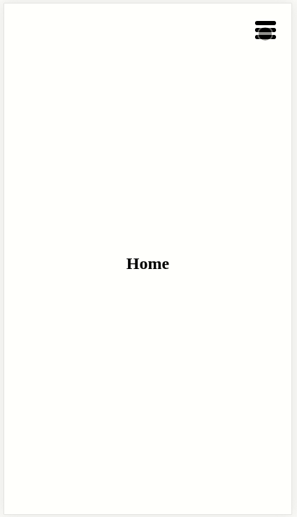

Photo by Tim Johnson on Unsplash

## Introduction

Let me first start off by saying who this tutorial is aimed at. This is not a beginner friendly tutorial, there are a lot of intermediate and advanced concepts here, and while I'll be trying my best to link to the relevant docs for everything that I use, I won't be deep diving into every technology and programming pattern.

In this article I'm going to walk you through some of the cool and interesting components of the menu for my wedding registry side project.



We'll use a bunch of React API's including react hooks like `useImperativeHandle`, React.Portal and more, as well as some cool CSS features like `mix-mode-color`.

I'll also be building in TypeScript.

## Let's get started.

In order to follow along, checkout [the final version in codesandbox.io](https://codesandbox.io/s/dreamy-thunder-0ypxe).

Maybe it's worth starting with my project folder structure. I have 4 folders inside the `/src` directory of my app; components, constants, hooks, and pages.

**components** contain all the React components that I use in my app, these are basically the building blocks of the app. They should be self contained and testable.

**constants** contain any top level constant values that get shared across multiple components and/or pages. In this app I'm using it to store the menu structure for the app.

**hooks** contain any custom hook components that only provide functionality to components and pages. The react docs have a section on [building your own hooks](https://reactjs.org/docs/hooks-custom.html) if you want to read more on it.

And lastly, **pages** is a folder that contains the top level components that make up the routes for the app. A convention I've adopted from next.js.

Outside of the folder structure, but still inside the `/src` directory there is `App.tsx` and `index.tsx`. Both are standard from create-react-app. `index.tsx` is the entry point to the app and is where React mounts the app into the DOM, and `App.tsx` is basically the top level component for our actual app code.

Let's start our discussion in `App.tsx`.

I used React Router to create the different routes in this app, but there's nothing fancy going on. I've basically just copied the first example in the [react router docs](https://reacttraining.com/react-router/web/guides/quick-start). So if you want more information on how to set that up I'd suggest looking there first.

The only thing I did differently from the react-router example was split out the routes into separate files, which I like to put in a `/src/pages` directory. That's just my personal preference though. The route components don't have anything in them really, just a page title.

The more interesting component is the `<NavBar />` component.

Let's checkout `src/components/NavBar/NavBar.tsx`.

Ok, so there are a couple more personal choices I've made with this folder structure. You'll notice that inside the `/src/components/NavBar` folder there are three components; Desktop.tsx, Mobile.tsx and NavBar.tsx. As you'll see in a minute when we step through them, we actually render different components for mobile users and desktop users. Having all three components together makes sense to me because they are all part of the NavBar.

Where were we? Oh yeah, `src/components/NavBar/NavBar.tsx`

One of the requirements for my app is that it needs to be mobile first, but also responsive to desktop (larger) screens. This meant I had separate designs for the mobile experience and desktop experience.

At first I tried to do this with CSS media queries, but soon discovered that wasn't going to work because the menu structures for mobile vs desktop are fundamentally different.

The mobile experience launches a full screen take-over modal, where as the desktop experience has the more traditional top navigation bar.

I needed a way to render different components depending on the screen size the user was using.

The solution I found was to use the [window.matchMedia()](https://developer.mozilla.org/en-US/docs/Web/API/Window/matchMedia) method, which allows us to pass in a media query and returns a `MediaQueryList` which we can use to see if the media query matches or not. The MDN docs show that this is supported by all the browsers so I'm pretty happy with this solution.

To use it, let's create our nav bar component. I'll show you the code first, and then we'll go through the important parts together.

./src/NavBar.tsx

```tsx
import React, { useState, useEffect } from "react";
import DesktopNav from "./Desktop";
import MobileNav from "./Mobile";

const mediaQuery = "screen and (min-width: 768px)";

const NavBar: React.FC = () => {
  const mql = window.matchMedia(mediaQuery);
  const [showDesktopMenu, setShowDesktopMenu] = useState(mql.matches);

  useEffect(() => {
    const handleMediaChange = function (this: MediaQueryList) {
      setShowDesktopMenu(this.matches);
    };
    mql.addEventListener("change", handleMediaChange);
    setShowDesktopMenu(mql.matches);

    return () => {
      mql.removeEventListener("change", handleMediaChange);
    };
  }, [mql]);

  if (showDesktopMenu) {
    return <DesktopNav />;
  }
  return <MobileNav />;
};

export default NavBar;
```

Firstly we call `window.matchMedia` and pass in a media query, which returns a MediaQueryList object. The media query list has a `matches` property on it which will be `true` if the media query holds true, or `false` otherwise. Basically if the `.matches` property is `true`, then we want to show the desktop menu navigation component, and if it's false we want to show the mobile navigation component.

By creating an event listener from inside the useEffect hook, we can trigger a state change whenever the media query changes from < 768px to >768px (taken from our media query constant).

Now if the user re-sizes their browser window, the correct menu will show.

The `NavBar.tsx` component is a pretty small, but powerful component. It doesn't do a lot on it's own in terms of rendering, but instead works as a switch to switch between which navigation component to render (mobile or desktop).

Ok, let's move on!

I won't talk too much about the `Desktop.tsx` NavBar component as it's pretty straight forward. We just loop over the menu structure constant from the `/src/constants/menu.ts` and render out the menu items, using the CSS property `position: fixed` to keep them at the top of the screen even while the user scrolls. A pretty standard menu experience.

The more interesting component to talk about is the `Mobile.tsx` NavBar component, so let's get into that.

The way our mobile navigation is going to work is the hamburger menu item is going to launch a full screen modal when clicked. Logically the modal component makes sense to me as the menu is sitting on top of the rest of the app in full screen. I'm also thinking from an accessibility standpoint it makes sense too, as when the menu is open, the focus should immediately move to the menu, and stay there until the menu is closed, the same way that a modal would work.

So, to create the mobile navigation, we first need a `Modal` component, but what's the best way to create a Modal? I like the use Portals. React Portals provide a first-class way to render children into a DOM node that exists outside the DOM hierarchy of the parent component.

What does that mean? Well, it means we can render components to the DOM that are outside of the `<div id="root"></div>` node that our entire app gets rendered to. This also makes sense to me because a Modal isn't really part of the app itself, they exist outside and lay over the rest of the app while they are active.

So to recap, in order to make our menu navigation component, we first need to make a modal component...BUT, in order to make the modal component, we first need to make a portal! Fun times.

In order to successfully create a portal, we need a node in our html that we can mount it too. Similar to how we mount our app to `<div id="root"></div>`, we need to create a DOM node that we can latch our portal on to. To do this we can simply modify the `/public/index.html` file and add a new div after the root div.

Here we will mount our modal portal, add this...

```html
<div id="modal"></div>
```

immediately after where you see

```html
<div id="root"></div>
```

The final result you should see a body that looks like this:

```html
<body>
  <noscript>
    You need to enable JavaScript to run this app.
  </noscript>
  <div id="root"></div>
  <!-- Here we will mount our modal portal -->
  <div id="modal"></div>
  <!--
    This HTML file is a template.
    If you open it directly in the browser, you will see an empty page.

    You can add webfonts, meta tags, or analytics to this file.
    The build step will place the bundled scripts into the <body> tag.

    To begin the development, run `npm start` or `yarn start`.
    To create a production bundle, use `npm run build` or `yarn build`.
  -->
</body>
```

With that out of the way, let's look at the Portal component.

./components/Portal.tsx

```tsx
import { FC, useRef, useEffect, useState, ReactChild } from "react";
import { createPortal } from "react-dom";

interface Props {
  children: ReactChild;
}

const Portal: FC<Props> = ({ children }) => {
  const ref = useRef<Element | null>(null);
  const [mounted, setMounted] = useState(false);

  useEffect(() => {
    ref.current = document.querySelector("#modal");
    setMounted(true);
  }, []);

  if (ref.current !== null && mounted) {
    return createPortal(children, ref.current);
  }
  return null;
};

export default Portal;
```

The portal component doesn't do a lot, we just get a reference to the DOM node that we just added to our `index.html` file, and then use it to return a react portal component. The Portal component will render any children it has into the `<div id="modal"></div>` element we just added to the index.html. Sweet!

Now we can create a Modal component that will add some contents to the portal when we want to display the modal. Because the portal is an entirely different DOM node than the rest of the app, it will be layered on top of all other components (barring any additional z-indexing we need to be careful of), which is the expected behaviour of a modal.

Let's look at the Modal components (warning, big component approaching).

./components/Modal.tsx

```tsx
/** @jsx jsx */
import { css, jsx, SerializedStyles } from "@emotion/core";
import {
  useState,
  useEffect,
  ReactChild,
  useRef,
  forwardRef,
  FC,
  MutableRefObject,
} from "react";
import { CSSTransition } from "react-transition-group";
import Portal from "./Portal";

interface Props {
  isOpen: boolean;
  handleClose: () => void;
  preventCloseOnOutsideClick?: boolean;
  classNames?: string;
  transitionStyles?: SerializedStyles;
  children: ReactChild;
}

enum Display {
  hide = "none",
  show = "flex",
}

const Modal: FC<Props> = ({
  children,
  handleClose,
  isOpen,
  transitionStyles,
  preventCloseOnOutsideClick = false,
  classNames = "modal-transition",
}) => {
  const [display, setDisplay] = useState<Display>(Display.hide);
  const nodeRef = useRef<HTMLDivElement>(null);
  const onOutsideClick = preventCloseOnOutsideClick
    ? () => void 0
    : handleClose;

  const show = () => setDisplay(Display.show);
  const hide = () => setDisplay(Display.hide);

  return (
    <Portal>
      <div
        className="modal"
        role="dialog"
        aria-modal="true"
        onClick={onOutsideClick}
        css={[containerStyles(display), transitionStyles]}
      >
        <CSSTransition
          nodeRef={nodeRef}
          in={isOpen}
          timeout={200}
          classNames={classNames}
          unmountOnExit
          onEnter={show}
          onExited={hide}
        >
          <InnerModal
            ref={nodeRef}
            children={children}
            handleClose={handleClose}
          />
        </CSSTransition>
      </div>
    </Portal>
  );
};

const containerStyles = (display: Display) => css`
  display: ${display};
  justify-content: center;
  align-items: center;
  position: fixed;
  top: 0;
  right: 0;
  bottom: 0;
  left: 0;
  overflow-y: auto;
  z-index: 10;
  background-color: rgba(0, 0, 0, 0.2);
`;

// Separated out into it's own component because refs was
// acting funny to child elements of the CSSTransition component
interface InnerModalProps {
  children: ReactChild;
  handleClose: () => void;
}

type Ref = HTMLDivElement | null;

const InnerModal = forwardRef<Ref, InnerModalProps>(
  ({ children, handleClose }, modalRef) => {
    // To make the modal nice and accessible, we want to trap the
    // focusable elements to only elements from inside the modal

    const ref = modalRef as MutableRefObject<HTMLDivElement>;

    const handleTabKey = (e: KeyboardEvent) => {
      if (ref && ref.current) {
        const inputModalElements: NodeListOf<HTMLInputElement> = ref.current.querySelectorAll(
          'a[href], button, textarea, input[type="text"], input[type="radio"], input[type="checkbox"], select'
        );
        const primaryMenuButton = document.getElementById(
          "primary-menu-button"
        ) as HTMLButtonElement;
        const firstElement = inputModalElements[0];
        const lastElement = inputModalElements[inputModalElements.length - 1];

        switch (document.activeElement) {
          case lastElement: {
            if (!e.shiftKey) {
              primaryMenuButton.focus();
              return e.preventDefault();
            }
            break;
          }
          case firstElement: {
            if (e.shiftKey) {
              primaryMenuButton.focus();
              return e.preventDefault();
            }
            break;
          }
          case primaryMenuButton: {
            if (e.shiftKey) {
              lastElement.focus();
            } else {
              firstElement.focus();
            }
            return e.preventDefault();
          }
          default:
            break;
        }
      }
    };

    const keyListenersMap = new Map([
      [27, handleClose],
      [9, handleTabKey],
    ]);

    /* Add an event listener so when we tab through focusable elements, we only
    focus on the elements inside the modal */
    useEffect(() => {
      function keyListener(e: KeyboardEvent) {
        const listener = keyListenersMap.get(e.keyCode);
        return listener && listener(e);
      }

      document.addEventListener("keydown", keyListener);

      return () => document.removeEventListener("keydown", keyListener);
    }, [keyListenersMap]);

    /* There is an issue with modals where when you close the modal, the window 
    scrolls back to the top of the page, this makes the window honour the users last scroll
    position */
    useEffect(() => {
      // When the modal is shown, we want a fixed body to prevent scrolling
      const onMountScrollY = window.scrollY;
      document.body.classList.add("modal-open");
      document.body.style.top = `-${onMountScrollY}px`;

      return () => {
        // When the modal is hidden...
        const onUnmountScrollY = document.body.style.top;
        document.body.classList.remove("modal-open");
        document.body.style.top = "";
        window.scrollTo(0, parseInt(onUnmountScrollY || "0", 10) * -1);
      };
    }, []);

    return (
      <div
        css={innerModalStyles}
        ref={modalRef}
        onClick={e => {
          e.preventDefault();
          e.stopPropagation();
        }}
      >
        {children}
      </div>
    );
  }
);

const innerModalStyles = css`
  width: 100%;
`;

export default Modal;
```

Ohhhkay, so admittedly this is a massive component, and just to confuse you further, I even put two components in the one file. I think it makes sense to have both components in here though as I'll explain in a second, bear with me.

There are two components, there is the modal container which is position fixed and takes up the full screen. This is actually the slightly transparent section outside of the modal that the user sees. With most modals, if you click somewhere on this transparent section, it closes the modal.

The second component is the component that holds the actual modal content. By separating these sections out into two different components, we are able to do some cool transitions on the inner modal component to give the modal the effect to fading in/out, or sliding in/out.

Let's go through this in detail.

The first component is the wrapper component, let's talk about the props that it takes:

| Prop                       | Required? | Type             | Description                                                                                                                                                                     |
| -------------------------- | --------- | ---------------- | ------------------------------------------------------------------------------------------------------------------------------------------------------------------------------- |
| isOpen                     | Yes       | boolean          | Will show or hide the modal. We need to use an isOpen boolean instead of conditionally rendering the modal in order to show CSS transitions as the modal gets mounted/unmounted |
| handleClose                | Yes       | () => void       | A function that is called to close the modal                                                                                                                                    |
| preventCloseOnOutsideClick | No        | boolean          | Allows this component to be more generic to modals. Sometimes we want modals to close when you click the area outside the modal, sometimes we don't                             |
| classNames                 | No        | string           | Pass in custom styles for the modal                                                                                                                                             |
| transitionStyles           | No        | SerializedStyles | Pass in custom transition styles to react-transition-group                                                                                                                      |
| children                   | Yes       | ReactChild       | The contents of the modal                                                                                                                                                       |

If you look inside this component it doesn't do a whole lot, it keeps some state to say if the modal should be hidden or not, and has a function called `onOutsideClick` that will close the modal if the user clicks outside of the modal content component.

The `InnerModal` component is wrapped with a `CSSTransition` which we get from react-transition-group. This allows us to give the modal transition effects as it gets mounted/unmounted and you can find out more about it [here](https://reactcommunity.org/react-transition-group/css-transition).

The meaty part of this file is the `InnerModal` component. This is the component that will hold all the modal content. Most of the code here is just to help with accessibility.

Imagine you didn't have access to a mouse, and were navigating through your app with just a keyboard. When you open up a modal you would expect to be able to tab through all the focusable elements within the modal. After you tab through all the focusable elements though, the default behaviour in the browser, would be to keep tabbing through all the other focusable elements on your app, outside the modal. This doesn't make sense. So the first function, `handleTabKey` fixes that by looping through only the focusable elements of the modal while it's open.

The second useEffect function, makes sure that when the user closes the modal, they return to the same scroll position that they were at before opening the modal. The default behaviour of the browser (at least in Chrome) is to return the user to the top of the page which doesn't make sense for the user.

Phew! That Modal component was big! But hopefully you can see that it makes sense to contain all the modal logic within the one file. With the Modal component in place, we can finally talk about the mobile navigation!

./components/NavBar/Mobile.tsx

```tsx
/** @jsx jsx */
import { css, jsx } from "@emotion/core";
import { useState, useRef, Fragment } from "react";
import { Link } from "react-router-dom";
import Modal from "../../components/Modal";
import MenuButton, { MenuButtonRef } from "../../components/MenuButton";

import { menu } from "../../constants/menu";

const MobileNav: React.FC = () => {
  const [menuOpen, setMenuOpen] = useState(false);
  const menuButtonRef = useRef<MenuButtonRef>(null);

  const toggleMenu = () => {
    setMenuOpen((prevState: boolean) => !prevState);
    if (menuButtonRef.current) {
      menuButtonRef.current.triggerTransition();
    }
  };

  return (
    <Fragment>
      <MenuButton ref={menuButtonRef} onClick={toggleMenu} />
      <Modal
        classNames="menu-transition"
        handleClose={toggleMenu}
        isOpen={menuOpen}
        transitionStyles={transitionStyles}
      >
        <nav css={styles}>
          {menu.map((menuItem, index) => (
            <Link
              key={menuItem.route}
              to={menuItem.route}
              className={`menu-item-${index}`}
              onClick={toggleMenu}
            >
              {menuItem.title}
            </Link>
          ))}
        </nav>
      </Modal>
    </Fragment>
  );
};

const styles = css`
  background-color: #010101;
  height: 100vh;
  width: 100%;
  display: flex;
  flex-direction: column;
  justify-content: center;
  align-items: center;

  a {
    color: #595b5b;
    font-size: 32px;
    line-height: 40px;
    font-family: "Poppins", sans-serif;
    font-weight: 500;
    text-decoration: none;
    width: 100%;
    display: flex;
    align-items: center;
    justify-content: center;
    padding: 10px 0;
  }

  a:hover,
  a:focus {
    color: white;
    cursor: pointer;
    outline: none;
  }

  .rsvp {
    position: absolute;
    bottom: 40px;
    border: 2px #595b5b solid;
    width: auto;
    padding: 5px 50px;
  }

  .rsvp:hover,
  .rsvp:focus {
    border-color: white;
  }
`;

const transitionStyles = css`
  .menu-transition-enter {
    transform: translateX(-100%);

    a {
      opacity: 0;
      transform: translateY(-10px);
    }
  }
  .menu-transition-enter-active {
    transform: translateX(0);
    transition: transform 300ms;
  }
  .menu-transition-enter-done {
    a {
      opacity: 1;
      transform: translateY(0px);
      transition: opacity 200ms linear, transform 500ms ease-out;
    }
    .menu-item-0 {
      transition-delay: 0ms;
    }
    .menu-item-1 {
      transition-delay: 50ms;
    }
    .menu-item-2 {
      transition-delay: 100ms;
    }
    .menu-item-3 {
      transition-delay: 250ms;
    }
  }
  .menu-transition-exit {
    transform: translateX(0);
  }
  .menu-transition-exit-active {
    transform: translateX(-100%);
    transition: transform 300ms;
  }
`;

export default MobileNav;
```

The first thing you might notice is that the component itself is quite small, the bulk of the contents of this file is just CSS. That's because a lot of the functionality is leveraged from the other components like the Modal component.

One issue I had with the modal approach for the menu was the open/close button. I wanted the button to stay fixed to the top left corner. Obviously the open button needs to exist outside the modal because the modal isn't rendered initially. But then after the modal gets opened what should happen? Should the modal contain the close button? I think logically that makes the most sense in terms of where the close button should exist within the DOM, but from a UX standpoint, I wanted one button to do both the opening and closing. Putting the close button outside the modal I think is fine as I can use z-indexing to make it appear to be infront visually, and I can update the `handleTabKey` function from inside the modal to make sure the close button remains inside the focusable elements (for accessibility, so the user can still tab to the close button).

Having a single button for both open and close also meant that we can do a nice transition on the SVG as the menu is opening or closing.

Another issue I had with the open/close button was that from inside the menu, there is another way to close the menu. Which is by clicking on a menu item. Closing the menu is easy because we can just call `setMenuOpen(false)` to close the modal. The problem is when the open/close button is clicked, the click event also triggers an animation that transforms the hamburger icon to a cross icon and visa-versa. Without triggering that animation, the menu would close but the menu icon would remain as a cross and it would get in this backwards state.

I needed to be able to trigger the transition from outside the MenuButton component.

The answer to this problem can be seen in the `toggleMenu` function. First I create a reference to the MenuButton, which I can use to call a function from inside the MenuButton but calling `menuButtonRef.current.triggerTransition();`.

While we're on the topic, let's take a detour and look into the `/src/components/MenuButton.tsx` component and take a look how this achieved.

Confession time! I didn't write any of the code for the animation of the menu icon when it opens and closes. It was inspired by [a post on dribbble.com by Tamas Kojo](https://dribbble.com/shots/2265620-hamburger-menu), and developed by Luis Manuel. Luis wrote a cool blog post about it [here](https://tympanus.net/codrops/2015/11/12/animating-svg-menu-icon-segment/) which I recommend checking out. All I did was update a couple of things so it would work with the newer version of d3, and extracted it out into a custom hook.

You'll see on line 19 that the custom hook (useMenuButtonTransition) exposes a function called `triggerTransition` that I call to start the animation for converting the button from the open state to the closed state and visa-versa.

Now, the issue I had was that I needed to call this function, which is internal to the MenuButton component, outside of the menu button. This is where `useImperativeHandle` hook comes to the rescue!

useImperativeHandle is a first citizen hook in the react API. You can check it out [here](https://reactjs.org/docs/hooks-reference.html#useimperativehandle) in the docs. The docs say "`useImperativeHandle` customizes the instance value that is exposed to parent components when using `ref`".

Basically it allows us to attach the `triggerTransition` function onto the ref instance which allows us to call the function as we saw in the `Mobile.tsx` component with `menuButtonRef.current.triggerTransition`. Pretty sweet!

Detour complete! Let's go back to the `/src/components/NavBar/Mobile.tsx` component.

After the `<MenuButton />` component, we have the Modal. We have the Modal closed by default, which we set in state. The classNames prop is the string "menu-transition", which sets the className that we use for the transition styles. If you look back at the Modal component, you'll see that the classNames prop is being passed straight through to the CSSTransition component from react-transition-group, and you can read more about their API and how it works [here](https://reactcommunity.org/react-transition-group/css-transition). The docs will show you why the `transitionStyles` css has it's naming convention with `.menu-transition-enter`, and `.menu-transition-enter-active` etc so I won't go into that here.

The last thing that I wanted to cover was some of the CSS used for the mobile and desktop navigation components.

You'll see it in both the `/src/components/NavBar/Desktop.tsx` and the `/src/components/MenuButton.tsx` components. And it's the CSS property `mix-blend-mode: difference;`.

I first stumbled across this effect in [a CSS-Tricks article](https://css-tricks.com/reverse-text-color-mix-blend-mode/) that built a loading animation where the background color fills up the space as the "percent complete" fills up, and because the text is the same color as the background, you can see the text color change as the background fills over it. A really cool effect and uses only CSS.

The biggest gotcha is that the background color of the container needs to be the opposite color of the color you want to the text to change to in the RGB scale. And transparent backgrounds don't work, so if the container background color is white, you need to explicitly set the color to white.

So for example, you'll see that the SVG has a stroke fill of white. By also giving the main element, it's container, a background color of white the `mix-blend-mode: difference` comes into effect and changes the SVG to black. (The opposite of the background color).

If the `main` element's background-color changes, then the SVG color changes to be the opposite color on the RGB scale.

The cool thing about mix-blend-mode is that it also works if the background of a container is an image where the background isn't a consistent color. The color of the text will change pixel by pixel, allowing it to always be visible. Pretty neat.

## Conclusion

This has been a super fun little project using lots of cool features of React and CSS. The purpose was to create a mobile-first, but also responsive menu that was highly accessible to all users and I think we've achieved that.

The portal and modal components can now be reused for other pop-ups and modals for our app, and the menu button animation being encapsulated inside it's own hook means it can easily be swapped out for different animations if we choose to.

Thanks for reading, and until next time,

Happy Coding!
