Photo by Cristina Gottardi on Unsplash

## Introduction

I recently deployed my AWS Amplify app, and added end-to-end (E2E) testing with cypress in the build pipeline. This means everytime I push a commit to GitHub, Amplify will automatically provision and build my app, and then run any E2E tests.

If a test fails, then Amplify will stop the pipeline and won't deploy. You can also set up alerts so you get an email or slack notification when the pipeline fails.

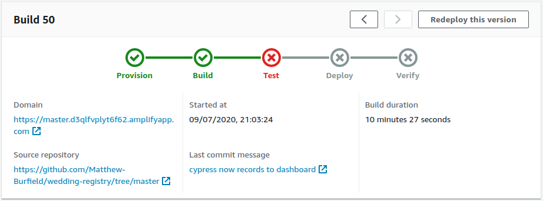
A failed pipeline build in AWS Amplify

If everything passes, then it will deploy the app as well! This my friends, is continuous integration and deployment (CI/CD) and if you haven't seen it in action before, it's pretty sweet.

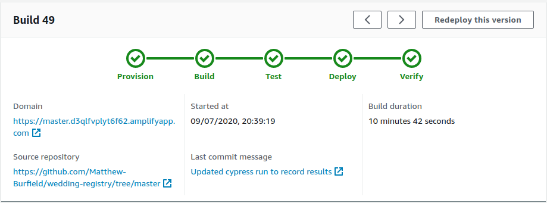
A passing and completed build in AWS Amplify

I spent a fair amount of time getting this working, and many of the resources I found online (like this [tutorial](https://aws.amazon.com/blogs/mobile/run-end-to-end-cypress-tests-for-your-fullstack-ci-cd-deployment-with-amplify-console/)), were all out of date. So I decided to write a new tutorial - I hope it helps!

## Let's get started.

### Set up a project locally

I'll be using create-react-app for my app, but you can substitute that with whichever framework you want. I also like to use `yarn` as my package manager, but if you prefer `npm`, just substitute any yarn commands with the npm equivalent.

```bash
npx create-react-app amplify-e2e
cd amplify-e2e
```

Now initialize Amplify by running the `npx amplify init` command. I've added all the responses that I entered, but again, substitute any that you need to match your environment. One thing to note is that I already had an AWS profile set up on my machine, so your last two questions might look a bit different if you don't and need to set one up.

```bash
yarn global add @aws-amplify/cli
amplify init

? Enter a name for the project (amplifye2e)
? Enter a name for the environment (dev)
? Choose your default editor: (Visual Studio Code)
? Choose the type of app that you're building (javascript)
Please tell us about your project
? What javascript framework are you using (react)
? Source Directory Path (src)
? Distribution Directory Path (build)
? Build Command (yarn build)
? Start Command (yarn start)
? Do you want to use an AWS profile? (Yes)
? Please choose the profile you want to use (amplify-cli)
```

Now add authentication to your backend.

```bash
amplify add auth

? Do you want to use the default authentication and security configuration? (Default configuration)
? How do you want users to be able to sign in? (Username)
? Do you want to configure advanced settings? (No, I am done.)

amplify push
```

Now let's add an authentication component to our app! Amplify has pre-built UI components for React, Vue, Angular and React Native. You can read more about them in [the Amplify documentation](https://docs.amplify.aws/lib/auth/getting-started/q/platform/js#option-1-use-pre-built-ui-components).

```bash
yarn add aws-amplify @aws-amplify/ui-react
```

Update your `/src/App.js` with the following changes:

```jsx:title=/src/App.js
import React from "react";
import logo from "./logo.svg";
import "./App.css";

// highlight-start
import Amplify from "aws-amplify";
import { withAuthenticator, AmplifySignOut } from "@aws-amplify/ui-react";
import aws_exports from "./aws-exports";
Amplify.configure(aws_exports);
// highlight-end

function App() {
  return (
    <div className="App">
      <AmplifySignOut />
      <header className="App-header">
        
        <p>
          Edit <code>src/App.js</code> and save to reload.
        </p>
        <a
          className="App-link"
          href="https://reactjs.org"
          target="_blank"
          rel="noopener noreferrer"
        >
          Learn React
        </a>
      </header>
    </div>
  );
}

export default withAuthenticator(App); // highlight-line
```

Now let's run our project locally with the `yarn start` command.

```bash
yarn start
```

With that, you should see a browser window open with the Amplify Auth UI. Create a new account and log in. Remember the login details as you will use this account later for our E2E test!

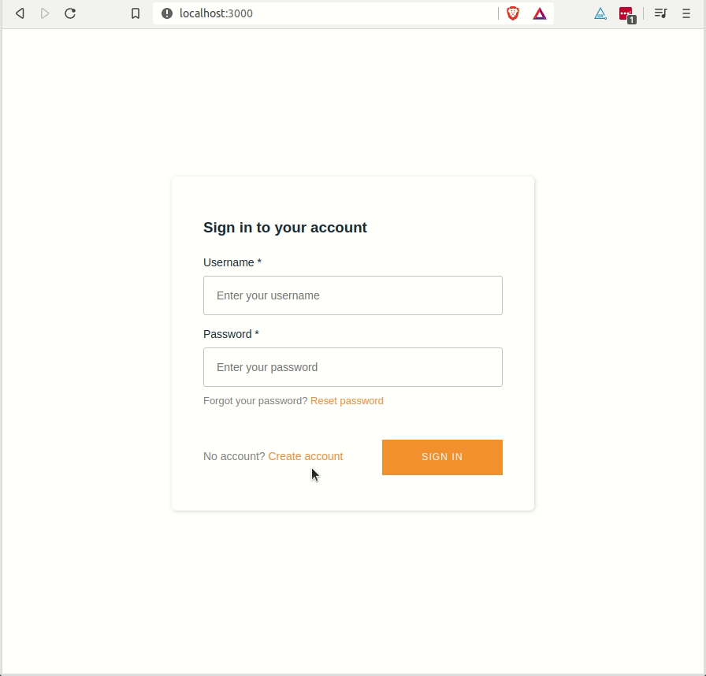
Creating a new user locally

### Side note - View your user in Cognito

Just a quick side note as this took me a while to figure out as well. If you're new to Amplify, you might wonder where the user you just created is stored. You can see the users for your Amplify apps by logging into the AWS console and going to the Cognito service. Click on "manage user pools" and then the name of your app. Amplify creates the name for you, mine's called: "amplifye2ef97ea632_userpool_f97ea632-dev". Click on that.

You should be presented with this screen:

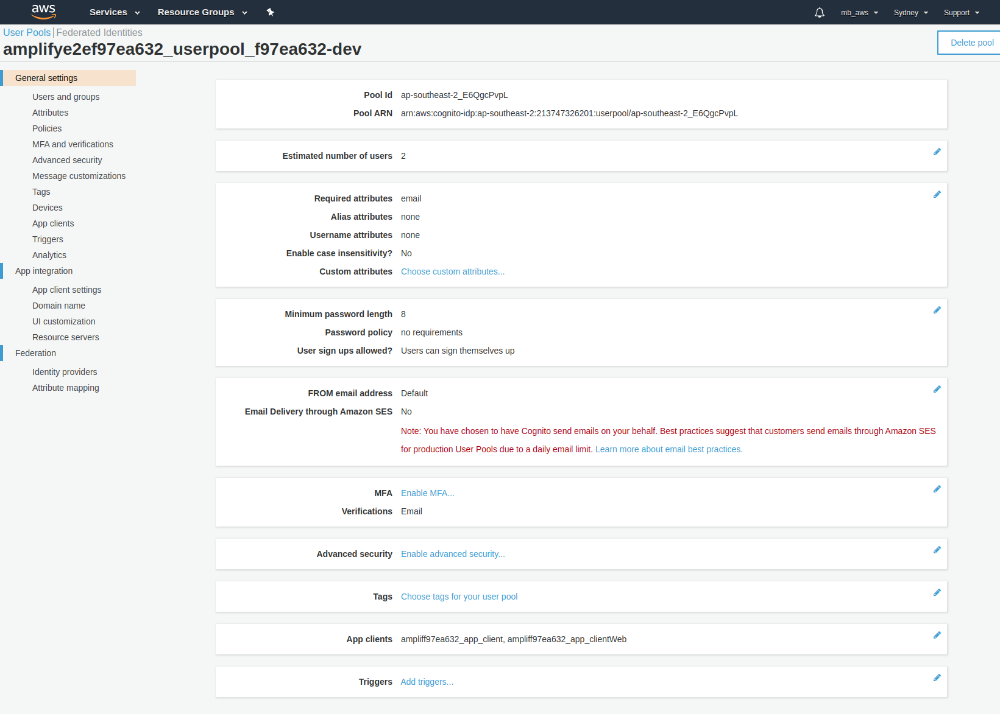
Your app's AWS user pool

Then click on "Users and groups" in the left hand menu which will take you to your users.

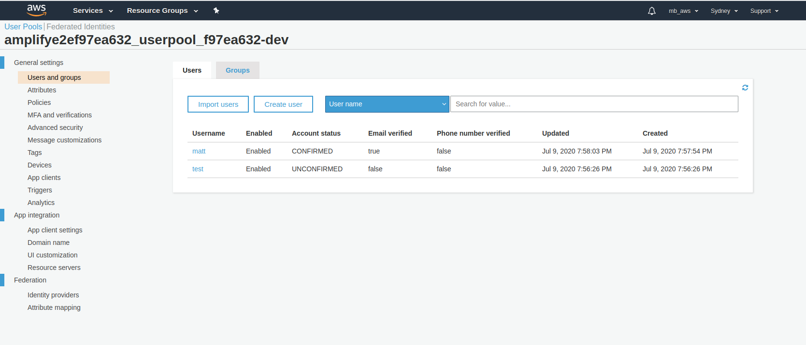
Your app's AWS users

### Create your first E2E test with Cypress

Cypress is a popular JavaScript-based testing framework for running E2E tests in the browser. Let's first install Cypress.

```bash
yarn add cypress --dev
```

When we first load Cypress, Cypress will initialize some files within our app - we'll take a look at these in a second. First, let's run Cypress on our app.

```bash
yarn start // (only if your local dev server isn't already running)
yarn cypress open
```

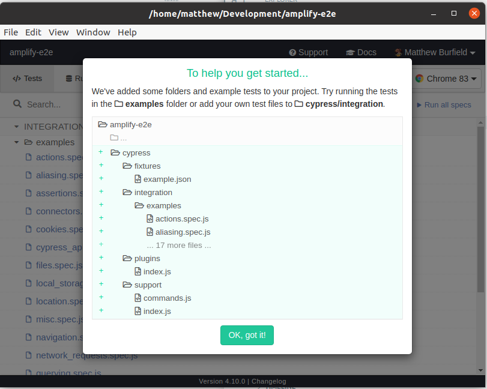
Loading screen of Cypress on first load

Here we can see the files that Cypress has injected into our app. They include some sample tests, and some configuration. For now we can just click the "OK, got it!" button.

Now that cypress has been initialized, feel free to click on the "Run all specs" button if you've never used Cypress before and want to see it in action, otherwise you can move on :)

### Bonus - Preparing Cypress to record to the Cypress dashboard

Cypress has a dashboard that you can use to report on all of your test runs!

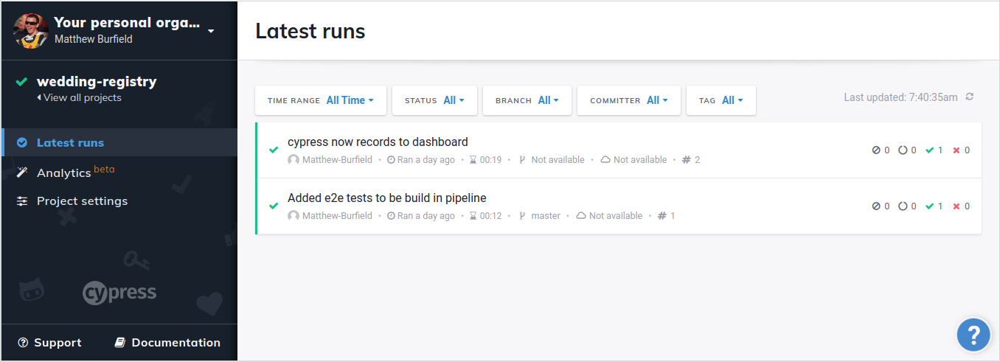
Screenshot of the Cypress dashboard

We can set up our project with Cypress now so later on when we are running our tests they save to the dashboard.

Back in our Cypress test runner window, click on the "Runs" tab, and then click on "Setup project to record". Cypress should guide you though a couple of steps to get setup.


The "Runs" tab of Cypress window

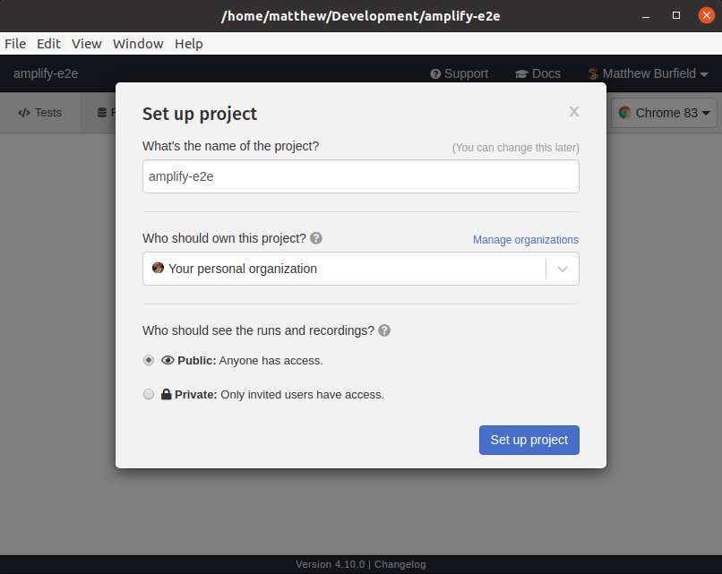
Setting up your Cypress project

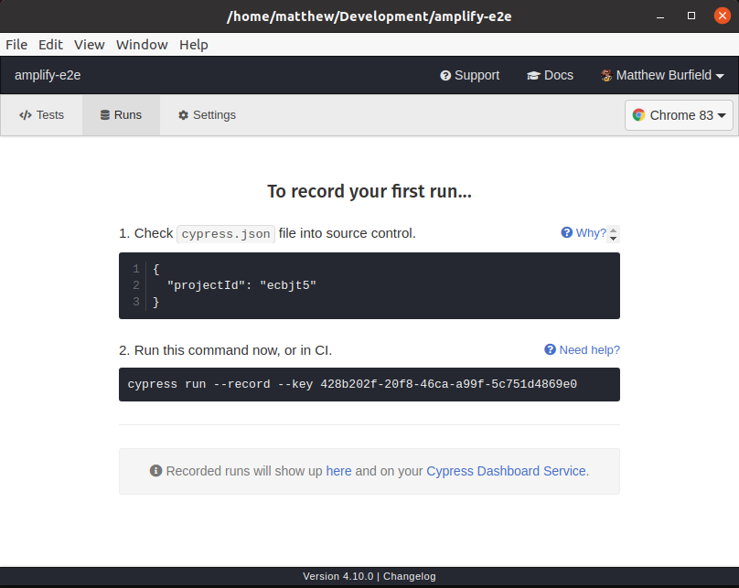
Cypress project confirmation window

In order to have Amplify push the results of your tests to the dashboard, you need to give it the "key" which I prefer to add as an environment variable in the AWS console. Logging into the [AWS amplify console](https://console.aws.amazon.com/console/home) and clicking on "Environment variables" in your app settings, create an environment variable called "CYPRESS_RECORD_KEY" and attach your key.

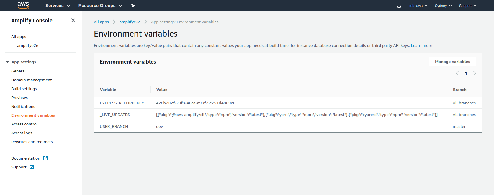
Adding environment variables to the AWS console

### Cypress setup

First we need to update the `/cypress.json` file to add some configuration settings. We want to add a base url so that in our tests, we don't need to type out "http://localhost:3000" every time, for each test. So let's add that now.

If you followed along on the previous steps, you should see cypress has already added your project id. If it hasn't, just run the cypress test runner again and get it from the "Runs" tab like in the previous step.

cypress.json

```json
{
  "projectId": "ecbjt5",
  "baseUrl": "http://localhost:3000" // highlight-line
}
```

Note that I'm using port 3000 because that's what create-react-app uses by default. If you're hosting your app somewhere else, just adjust your baseUrl accordingly.

Next, I like to add all my e2e tests to a folder named "e2e", instead of the default "integration" folder that cypress creates. (Thanks to [Kent C. Dodds](https://twitter.com/kentcdodds) for this tip). We can update the `cypress.json` file to accommodate this:

cypress.json

```json
{
  "baseUrl": "http://localhost:3000",
  "projectId": "ecbjt5",
  "integrationFolder": "cypress/e2e" // highlight-line
}
```

There's one last piece of configuration we need to do before we can test the authentication flow. Since Amplify updated it's UI components to the `@aws-amplify/ui-react` library, it now uses a shadow DOM to inject the Authentication UI which makes it a little trickier to test because the standard query selectors won't work.

Fortunately, as of version 4.8.0, cypress has [added an experimental feature](https://docs.cypress.io/guides/references/changelog.html#4-8-0) to support the shadow DOM! We just need to set one more flag in our cypress.json file to enable it.

cypress.json

```json
{
  "baseUrl": "http://localhost:3000",
  "projectId": "ecbjt5",
  "integrationFolder": "cypress/e2e",
  "experimentalShadowDomSupport": true // highlight-line
}
```

That's all the configuration we need to get rolling. Now let's go add some E2E tests!

### Creating our E2E tests

We need to create a new folder that matches our new integrationFolder path that we just created, so inside the `cypress` directory, create a new folder called "e2e". Inside the "e2e" folder, let's create our first test, `authenticator.spec.js`

This should give you a project file structure like this.

```text
- amplify-e2e
  - amplify
  - cypress
    - e2e// highlight-line
      `authenticator.spec.js`// highlight-line
    - fixtures
    - integration
    - plugins
    - support
  - node_modules
  - public
  - src
    .gitignore
    cypress.json
    package.json
    README.md
    yarn.lock
```

Here is the code for your first test. I've tried to add explanations in the comments

```javascript:title=/cypress/e2e/authenticator.spec.js
// Update these constants to match whatever username and password you
// created your user with
const USERNAME = "UPDATE_USER_NAME_HERE";
const PASSWORD = "UPDATE_PASSWORD_HERE";

describe("Authenticator:", function () {
  // Step 1: before each test, we want to visit our app.
  // Note that this takes into account the base url that we
  // already configured. So the final address will be
  // "http://localhost:3000/"
  beforeEach(function () {
    cy.visit("/");
  });

  describe("Sign In:", () => {
    it("allows a user to signin", () => {
      // Step 2: Usually we can use cy.get to go locate the
      // button or field that we want to action directly, but
      // because of the shadow DOM, we can only use cy.get on
      // elements outside any shadow DOM. So here we get the element
      // outside the shadow DOM, and then use cy.find command, passing
      // in the "includeShadowDom: true" flag, to tell cypress to look
      // inside the shadow DOM.

      // Cypress commands are all asynchronise and can be chained together.
      // Which is what I'm doing here. If you want, you can read more about
      // it in the cypress documentation:
      // https://docs.cypress.io/guides/getting-started/writing-your-first-test.html#Add-a-test-file
      cy.get("amplify-authenticator")
        .find(selectors.usernameInput, {
          includeShadowDom: true,
        })
        .type(USERNAME);

      cy.get("amplify-authenticator")
        .find(selectors.signInPasswordInput, {
          includeShadowDom: true,
        })
        .type(PASSWORD, { force: true });

      // This one was a bit tricky to get to. It seems as though
      // there are two sign in buttons and cypress doesn't like
      // trying to click on two buttons at the same time,
      // so I'm chaining the .first() method to just take the
      // first button it finds.
      cy.get("amplify-authenticator")
        .find(selectors.signInSignInButton, {
          includeShadowDom: true,
        })
        .first()
        .find("button[type='submit']", { includeShadowDom: true })
        .click({ force: true });

      // Step 3: Make an assertion (Check for sign-out text)
      // By this stage we should be logged in. Cypress has many different
      // assertions. Here we're just checking to see if the page contains
      // the sign-out button.
      cy.get("amplify-sign-out")
        .find(selectors.signOutButton, { includeShadowDom: true })
        .contains("Sign Out");
    });
  });
});

export const selectors = {
  // Auth component classes
  usernameInput: 'input[data-test="sign-in-username-input"]',
  signInPasswordInput: 'input[data-test="sign-in-password-input"]',
  signInSignInButton: 'amplify-button[data-test="sign-in-sign-in-button"]',
  signOutButton: "amplify-button",
};
```

Now we can run cypress again and (fingers crossed) we should see our test pass!

Run cypress again by running the command

```bash
yarn cypress open
```

And you should see your `authenticator.spec.js` test ready to go. If you are still seeing all the example tests that cypress added or not seeing any tests, go back and look at the configuration steps. Chances are your "integrationFolder" configuration doesn't match the path that you added your `authenticator.spec.js` test.

Hopefully we now have a passing test! Whoop whoop.

### Set up continuous delivery with the Amplify Console

The Amplify console provides a continuous deployment and hosting service for our amplify apps. To get started with our continuous deployment, let's first push our code to GitHub (or the git provider of your choice).

I created a new repo on GitHub called "amplify-e2e" and then ran these commands. Obviously change the origin to point to your own repo.

```bash
git add .
git commit -m "initialised app and added auth with e2e test"
git remote add origin https://github.com/Matthew-Burfield/amplify-e2e.git
git push origin master
```

Now log into the [AWS amplify console](https://console.aws.amazon.com/console/home) and you should see your app there. Note that if your app isn't there, you might need to switch to your region to the one you set up amplify with.

Clicking through to your app will show you a list of git providers. I'm selecting GitHub since that's where I pushed my code to, you can select whichever git provider you used.

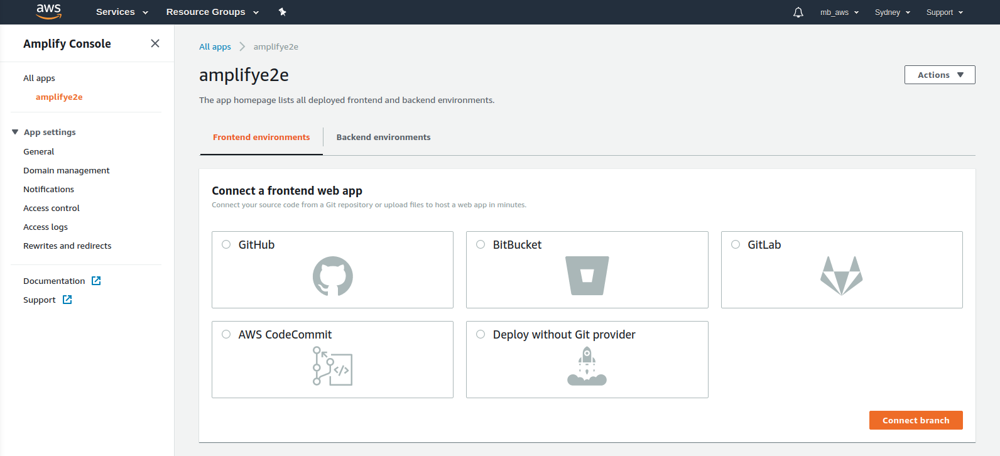
The list of repository providers in AWS console

Click "connect branch"

If you haven't already authorized amplify to your repository service provider, amplify will prompt you to do that, then select your repo and branch and click next.

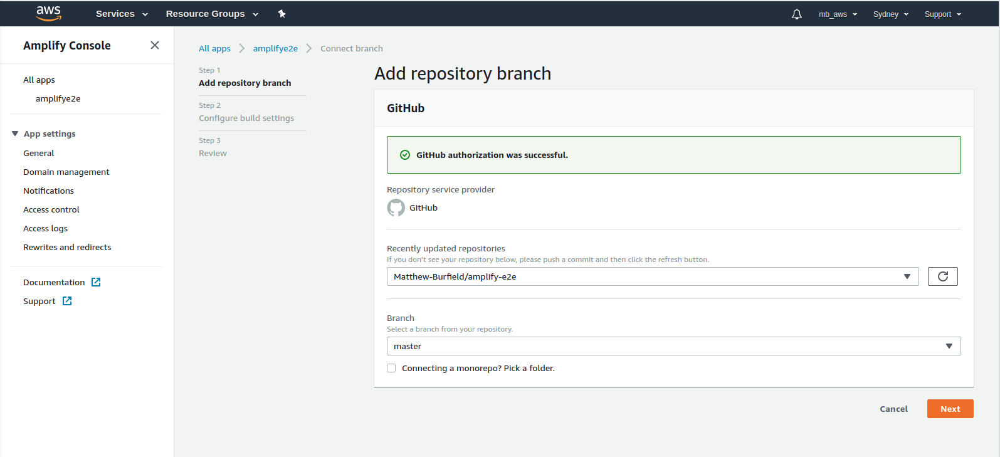
Selecting your repo and branch

The next screen will be the build settings configuration. If you've followed all the steps so far, amplify should automatically detect you're using React for your frontend framework, and cypress for your testing framework.

What we're interested in here is the "Build and test settings".

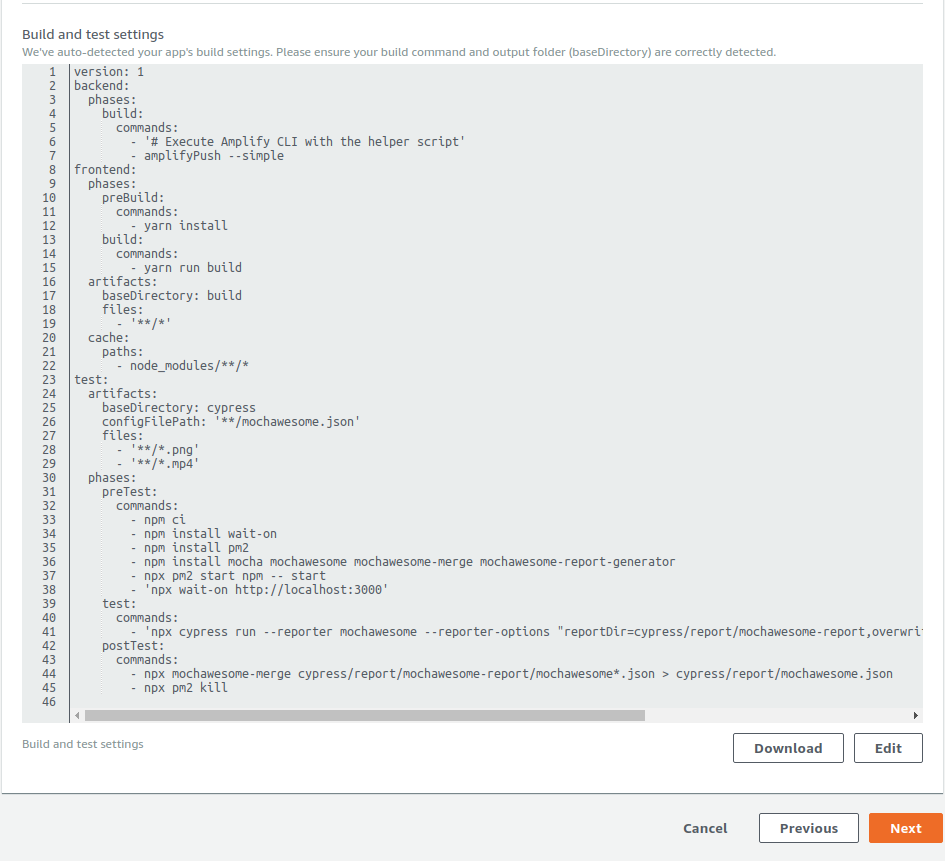
The default build and test settings

Most of it works out of the box, but there are a few things we need to update in for our create-react-app app, and to record our test results on the cypress dashboard.

Replace your build and test settings with this:

```yaml
version: 0.1
backend:
  phases:
    build:
      commands:
        - "# Execute Amplify CLI with the helper script"
        - amplifyPush --simple
frontend:
  phases:
    preBuild:
      commands:
        - yarn install --frozen-lockfile
    build:
      commands:
        - yarn build
  artifacts:
    baseDirectory: build
    files:
      - "**/*"
  cache:
    paths:
      - node_modules/**/*
test:
  artifacts:
    baseDirectory: cypress
    configFilePath: "**/mochawesome.json"
    files:
      - "**/*.png"
      - "**/*.mp4"
  phases:
    preTest:
      commands:
        - yarn install --frozen-lockfile
        - yarn add mocha mochawesome mochawesome-merge mochawesome-report-generator
        - "npx serve -l 3000 -s build & npx wait-on http://127.0.0.1:3000"
    test:
      commands:
        - 'npx cypress run --record --reporter mochawesome --reporter-options "reportDir=cypress/report/mochawesome-report,overwrite=false,html=false,json=true,timestamp=mmddyyyy_HHMMss"'
    postTest:
      commands:
        - npx mochawesome-merge@4 cypress/report/mochawesome-report/*.json > cypress/report/mochawesome.json
        - npx kill-port 3000
```

There are a few things that have changed from the default, and a few things that have stayed the same. Let's just go through each step together.

The first step is the backend. Amplify uses the Amplify CLI to run "amplifyPush --simple" which will do all the setup for you for any amplify services you are using. It also re-creates the `aws-exports.js` file for you, since we don't push it to our git repository because it contains sensitive information.

Next is the frontend.

the preBuild and build commands should be pretty self explanatory, it's just installing any node_modules via `yarn install`, and then building the project with the `yarn build` command.

One thing you might wonder about is the `--freeze-lockfile` flag that is passed to `yarn install`. It's basically the equivalent of the `npm ci` command that was in the default yml file. It prevents any more package changes from happening.

According to [the yarn documentation](https://classic.yarnpkg.com/en/docs/cli/install) - "If you need reproducible dependencies, which is usually the case with the continuous integration systems, you should pass --frozen-lockfile flag.

The artifacts will be the built files that we want to deploy. create-react-app puts all our build files in a directory called "build" for us, so we specify that here. Along with the fact that we want to deploy all the files in that folder.

Finally is the test phase.

Artifacts work the same as the frontend phase above.

Let's check out the preTest, test and postTest commands since there were a couple of changes here.

The first two commands (`yarn install` and `yarn add`) are exactly the same.

The third command has changed. We can't use the `yarn start` command here because that starts the webpack dev server from react-scripts. Instead we can create a static server with our production build that we can test against. Remembering that by the time CI runs this script, a successful build will have already been completed - it makes sense to test against the build we are just about to deploy. If you want to learn more about the serve command, you can see it in [the create-react-app docs](https://create-react-app.dev/docs/deployment)

The test command has stayed the same, except I've also added the "record" flag to tell it to record the tests and send to the cypress dashboard; Note that we don't need to pass the "key" flag, because we've already added our key as an environment variable.

And that's it for the build file!

One last thing to do in build settings, is to update the build image settings. Amplify gives you a list of live package updates that it will maintain for you in your build image. I've added `yarn` and `cypress` to be the latest versions.

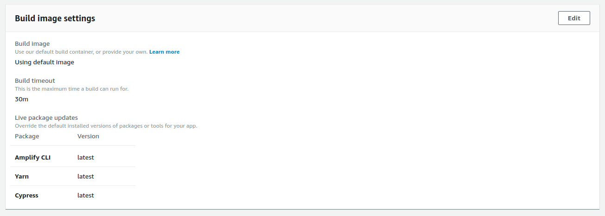
Amplify console build image settings

### Good job!!

We're done! You can now redeploy from the amplify console, or simply make an update locally and commit/push to your git repo and Amplify will see the new commit come through and redeploy.

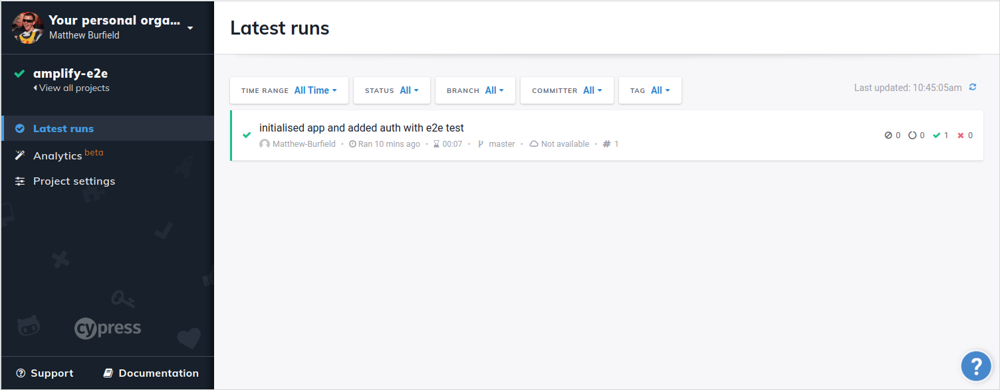
Screenshot of the cypress dashboard with first test results

Take a sip of coffee and watch on the Amplify console as it builds, tests and deploys your project for you! ☕️✌

## Conclusion

Phew! That was a lot. Take a minute and think about everything we just did.

We successfully set up a pipeline in Amplify that will continuously build and deploy our app. Not only that, but it will also run any end-to-end tests that we have using Cypress, and output those tests to the Cypress Dashboard!

Having this infrastructure in place will enable us to develop with speed and confidence knowing that our apps are fully tested before deployment!

Happy days.

Thanks for reading, and until next time,

Happy Coding!
