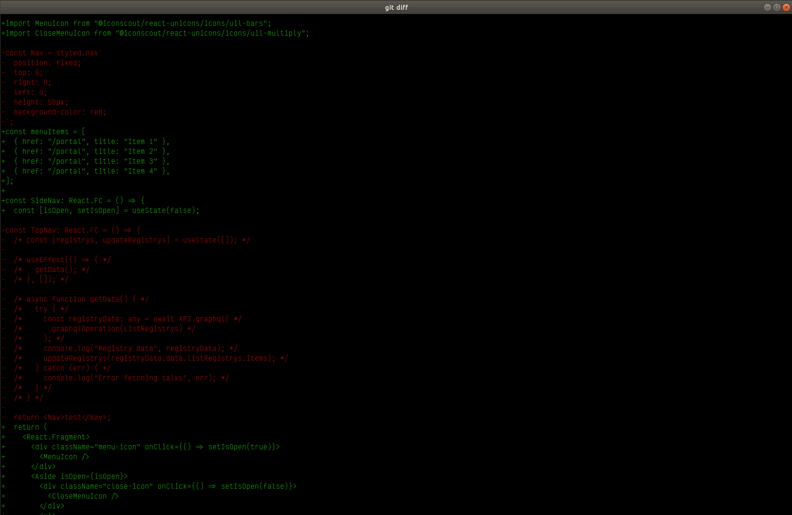

Photo by Sebastien Gabriel on Unsplash

## Introduction

A few weeks ago I read [a blog post](https://blog.jez.io/cli-code-review/) from
Jake Zimmerman called "Code Review from the Command Line" and I've adopted
some of the techniques he outlines in my own code reviews.

I've always liked doing my code reviews from the command line, it's a habit
I first developed while I was first learning through the Free Code Camp curriculum.

Using the `Git diff` on the command line works okay sometimes, especially when
I just want to review a small change I made before I commit it. It color codes the
additions and deletions and outputs them on top of one another similar to the
unified view on GitHub. It isn't an ideal solution though, especially for larger
reviews.


A screenshot of my terminal viewing the `git diff` command

With larger code reviews, and reviews with a lot of updates to a single file,
it's hard to get a sense of what really has changed. In the unified view, you can
quickly start to lose context of where the changes in a given file are 
when there is just a big wall of red, followed by a big wall of green (i.e. 
a big deletion followed by a big addition).

Another gripe I have with this approach is if I see a mistake with the code during
the review and want to make an edit, then I have to exit out of the diff, find that
file and edit it, and then go back into the diff to confirm the changes.
It would be so much nicer to just make those edits on the fly while the diff is
taking place.

In Zimmerman's article, he outlines an approach where he brings up the code diffs
in Vim, leveraging the power of the Vim editor and the terminal to put the diffs
side by side, with editing capabilities right in the diff.

Having the diffs side by side makes it so much easier to get context on where
the changes have been made within the file.


A screenshot of my terminal viewing the `git review` command

I mean, that looks pretty slick.

You get syntax highlighting with your specified colorscheme as a bonus,
and the full power of editing in Vim right there in your diff.

There are a just a few steps involved to get this working:

#### Adding aliases

Open up your `~/.bashrc` file, or the equivalent for your favourite shell, and
add this line:

```.bashrc
# For git review alias
export REVIEW_BASE=master
```

Now, open up your `~/.gitconfig` file and add this at the bottom of the file:

```.gitconfig
[alias]
  # list files which have changed since REVIEW_BASE
  # (REVIEW_BASE defaults to 'master' in my zshrc)
  files = !git diff --name-only $(git merge-base HEAD \"$REVIEW_BASE\")

  # Open all files changed since REVIEW_BASE in Vim tabs
  # Then, run fugitive's :Gdiff in each tab, and finally
  # tell vim-gitgutter to show +/- for changes since REVIEW_BASE
  review = !vim -p $(git files) +\"tabdo Gdiff $REVIEW_BASE\" +\"let g:gitgutter_diff_base = '$REVIEW_BASE'\"

  # Same as the above, except specify names of files as arguments,
  # instead of opening all files:
  # git reviewone foo.js bar.js
  reviewone = !vim -p +\"tabdo Gdiff $REVIEW_BASE\" +\"let g:gitgutter_diff_base = '$REVIEW_BASE'\"
```

#### Adding Vim plugins

Finally, in your `~/.vimrc` file, add the following plugins. (Here I'm using the
vim-plug plugin manager, you can use your own favourite plugin manager. Or, if
you haven't set one up yet, take a quick detour [here](https://github.com/junegunn/vim-plug)
and follow the instructions there to setup the plugin manager before moving on
to the next step)

```.vimrc
" ----------------------------------------------------------------------------
" Plugins
" ----------------------------------------------------------------------------

" Specify a directory for plugins.
call plug#begin('~/.vim/plugged')

" A git wrapper
Plug 'tpope/vim-fugitive'

" Show the git diff in the gutter with +/-
Plug 'airblade/vim-gitgutter'

" Initialize plugin system
call plug#end()
```

#### Here's how it works

Simply type `git reivew`. This will open each file changed in your current branch
as a separate tab in Vim. You'll see them in a side by side comparison.

Similarly, you have the command `git reviewone` which works like `git review`,
but you can specify which files you want to open (in case you only want to diff
one file).

By default, the diff will be compared to you master branch. If you need to compare
to a different branch, simply type:

```
REVIEW_BASE=different_branch git review
```

Where "different_branch" is replaced with whichever branch you want to compare to.

Or, if you want to change the default branch that you compare to, simply update
your `~/.bashrc` file and change the export to whichever branch you want.

If you've followed along to here, congratulations! You now have a completely
interactive code review with all the powerful editing capabilities of Vim!

While reviewing files in Vim, any edits you make will automatically be re-diffed,
so you'll be able to see any additional updates within the diff on the fly.

Now, if you have more than one file that you're diffing, you can simply move
to the next tab to review the next diff. In Vim, simply type:

```vim
:tabn
```

## Conclusion
 on the fly
This Git flow of comparing changes has really been a game changer for me, I'm
still able to really quickly review changes from the command line but now I get
the full power of an editor at my disposal while reviewing. And the side by side
comparison with syntax highlighting is a MUCH better experience than the regular
`git diff` command.

If you're interested in further tooling to help your Git reviews, such as viewing
stats of the files that have changed and to visualise relationships between changed
files from the command line as well, I strongly recommend you check out Zimmerman's
article that I referenced at the start of this post!

Happy Coding!
