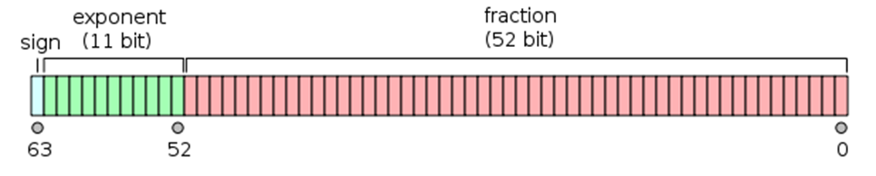

Photo by Federico Respini on Unsplash

## Introduction

```javascript
> const num = 0.1 + 0.2
> console.log(num) // 0.30000000000000004
```

Have you ever tried to run the above snippet? Is the answer what you expected?
If not, then you might find this post interesting.

First, we'll deep dive into how very large, and very small numbers can be represented in computer memory, and the international standard that is used. Then we'll use that knowledge, and tie it back to JavaScript, and how our new found knowledge might change the way we view certain JavaScript constructs.

#### The problem

The website [floating-point-gui.de](https://floating-point-gui.de/formats/fp/)
explains why floating-point numbers are needed in computers really well. It says
that since computer memory is limited, computers cannot store numbers with
infinite precision. But how much accuracy is needed? And _where_ is it
needed? How many integer digits _(before the decimal place)_ and how many
fraction digits _(after the decimal place)_ do we need?.

Consider these three use cases:

- A civil engineer is building a highway and measuring the length of a road. To the
  engineer, it doesn't matter if the road is 10 meters wide, or 10.0001 meters
  wide, since the measurements are probably not that accurate in the first
  place.
- An electrical engineer is designing a microchip, where 0.0001 meters (or 0.1
  millimeters) is a huge difference. But then the electrical engineer will never
  have to deal with distances larger than 0.1 meters.
- A physicist needs to use the speed of light (299,792,458 m/s) and Newton's
  gravitational constant (about 0.0000000000667) together in the same
  calculation.

The civil engineer, the electrical engineer and the physicist each have wildly
different needs when it comes to precision for the numbers they need to store.
But how do you store all these numbers in computer memory efficiently? Having
a fixed number of integer _(before the decimal place)_ and fractional digits
_(after the decimal place)_ is not at all efficient because of the orders of
magnitude of difference in the numbers that are required for each of the
example use cases listed above.

One of the solutions to this problem, and by far the most common, is _the floating point_.

#### A brief history

Floating point arithmetic, and therefore the issue of `0.1 + 0.2 !== 0.3`, is
not a JavaScript problem. In fact, floating point arithmetic has been around
since the early days of computers, as early as 1938 (JavaScript wasn't created
until 1995).

In 1985, The [IEEE](https://www.ieee.org/) standardised floating
point arithmetic with [the IEEE 754 standard](https://standards.ieee.org/content/ieee-standards/en/standard/754-2019.html). The standard addressed many problems which arose due to the diverse set of floating point implementations across different hardware and software products, and made floating points difficult to use reliably and portably.

#### Floating point numbers

In science when we are dealing with either really big
numbers, or really small numbers, it is common to represent those numbers in
scientific notation.

For example, planck's constant - which relates the energy carried by a photon,
to the photon's frequency, is a _really really_ small number. It is:

> 0.00000000000000000000000006626068

Which, in scientific notation we can simply write as:

> 6.626068 x 10<sup>`-34`</sup>

Here, we move the decimal point 34 places, denoted by the `order of magnitude`.

Similarly, Avogadro's constant - which relates the amount of substance in a
given sample (measured in moles), to the number of particles in that sample - is a _really really_ big number. It is:

> 602,300,000,000,000,000,000,000

Which, in scientific notation we can simple write as:

> 6.023 x 10<sup>23</sup>

We can generalize how scientific notation are written with the form:

> _m_ x 10<sup>n</sup>

Which you would read "m times ten, raised to the power of n".

**This scientific notation, when refered to in the sense of computer arithmetic, is what we call the floating point system**

The "times ten" bit is used in the above examples because we are using scientific notation to represent a number in the decimal number system, but we can also use scientific notation to represent numbers from the binary system, for example:

> 1.001011 x 2<sup>6</sup>

Is a binary number represented in scientific notation. This is the format that floating point numbers are stored.

Floating point numbers are the binary numbers that are written in the scientific
notation format, and it was the IEEE 754 standard that standardized how those
floating point numbers would be stored in memory.

#### IEEE 754

[The IEEE 754 standard](https://standards.ieee.org/content/ieee-standards/en/standard/754-2019.html) is for formatting floating point numbers and storing
them in computer memory. It is the same standard that JavaScript and many other
programming languages follow.

Of the different formats defined by the IEEE standard, we are most interested in the **double precision** standard, as this is what JavaScript uses to store all of it's number values. Double precision means that each number is stored in 64 bits of memory, which we'll break down now.


A graphical depiction of how double precision floating point numbers are stored in memory.

As you can see in the above image, there are 64 bits in total that are used to store a floating point number in the double precision format. The bits are grouped into the following:

- The sign (A single bit to represent if the number is a positive or negative value)
- The exponent (In the scientific notation examples we looked at earlier, this is the _"raised to the power of"_, or _"n"_ in our generalized example. 11 bits are reserved for the exponent which means the maximum exponent we can store is `1024`)
- The fraction (In the generalized scientific notation example, this is the _"m"_. You might also see it referred to as the mantissa)

If you want to get even deeper into how floating point values are stored in memory, check out [this article](https://docs.oracle.com/cd/E19957-01/806-3568/ncg_goldberg.html) which is super in-depth albeit a bit dry, or [this one from Brian Rinaldi](https://modernweb.com/what-every-javascript-developer-should-know-about-floating-points/) who does a great job at summarizing the first article and making it much more digestible to read.

#### Representation of special values

Did you know that in JavaScript you can have positive zero, and negative zero? In your browser console, try typing `-0/1`. This makes sense, when you think of the floating point format, and the bit designated for the sign. Zero, in floating point is stored as:

> - sign: 0 for positive zero, 1 for negative zero
> - exponent: all 0 bits
> - fraction: all 0 bits

The number `infinity` in JavaScript, can also be represented in floating point format.

> - sign: 0 for positive infinity, 1 for negative infinity
> - exponent: all 1 bits
> - fraction: all 0 bits

`NaN` _(Not a Number)_ in JavaScript, is also, technically stored as a floating point number. This is why in JavaScript:

```javascript
typeof NaN === "number" //true
```

as it's technically stored as a `number`. Therefore, a more accurate way of thinking of `NaN` values, are invalid or wrong - "Not a Number" isn't actually true in the literal sense.

`NaN` values are stored in the following floating point format:

> - sign: either a 0 bit or a 1 bit
> - exponent: all 1 bits
> - fraction: anything except all 0 bits

You may have noticed that both `infinity` and `NaN` both have all 1 bits for the exponent. All 1 bits for the exponent would convert to 2047 and is a special exponent to express either `infinity` or `NaN`.

A common gotcha for new programmers is to attempt and type safe your function by writing:

```javascript
if (typeof num === "number") {
  // do something
}
```

The issue is that, as we just saw, `NaN` is also technically a number. The correct way to test if something is a `number` is:

```javascript
if (typeof num === "number" && !Number.isNaN(num)) {
  // do something
}
```

#### Floating point values and the (in)famous rounding errors

In the decimal number system, we have numbers that repeat forever. For example, how would you write 1/3 as a decimal?

> 0.3333333333333333333333333333333333333333333333333333333333333333...

It just repeats infinitely. If we were to say this number out loud, we might say: "three point three three recurring". This is called a repeating decimal.

The concept of repeating numbers is true in all number base systems, including binary. `0.1` is one such number that in binary, will repeat infinitely. How do you represent `0.1` in binary you may ask?

> 0.0011001100110011001100110011001100110011001100110011001100110011...

Notice that `0011` is infinitely repeating.

This, ladies and gentlemen, is why `0.1 + 0.2 !== 0.3`, it's because `0.1` needs to be rounded due to only having 52 fractional bits to store the value of `0.1`.

To put it another way, We've just said that `0.1` in binary is `0.001100110011...`. What if we were to round to just 5 fractional bits? That would be `0.0001`, but `0.0001` in binary is actually `0.0625` if converted back to decimal! That's a rounding error of `0.0375`. If that was the case, then `0.1 + 0.2` would equal `0.2625`!

Fortunately for us, as we saw earlier, there are 52 bits available for the fractional component of each number, which makes the rounding errors we see in JavaScript relatively small, _almost_ unnoticeable, albeit still present.

Hopefully that makes sense why simple mathematically operations look to be wrong at first glance.

#### Floating point values in JavaScript

It should be said that for pretty much all of this I refer to the book series [You Don't Know JS](https://github.com/getify/You-Dont-Know-JS) by Kyle Simpson. It's an amazing series, Kyle goes into extreme detail on all parts of JavaScript and I highly recommend it.

All numbers in JavaScript are stored as floating point values. That is, JavaScript doesn't have a concept of different number data types like "integer", "float" and "double" like some other languages do. All numbers in JavaScript are a `number` type. For example:

```javascript
const a = 42 // This is number, stored as a floating point value in memory.
const b = 0.42 // This is also a number, stored as a floating point value in memory.
const c = 4e100 // This is also a number, and also stored as a floating point value in memory.
```

All these numbers in JavaScript, are wrapped with the native `Number` object which gives them access to the methods on the `Number` `prototype`, as well as properties on the native `Number` object.

For handling numbers in JavaScript, and getting around the issue of `0.1 + 0.2 !== 0.3;`, we can use these methods.

The most commonly accepted practice is to use a tiny "rounding error" value as the tolerance for comparison. This tiny value is often called "machine epsilon", which is commonly 2<sup>-52</sup> (or 2.220446049250313 x 10<sup>-16</sup> to be more exact) for `numbers` in JavaScript.

As of ECMAScript 2015, `Number.EPSILON` is predefined with this tolerance value, and we can use this `Number.EPSILON` value to compare two `number` values for "equality". By "equality", we mean that it is within the rounding error tolerance in JavaScript.

```javascript
function numbersCloseEnoughToEqual(n1, n2) {
  return Math.abs(n1 - n2) < Number.EPSILON
}

var a = 0.1 + 0.2
var b = 0.3

numbersCloseEnoughToEqual(a, b) // true
numbersCloseEnoughToEqual(0.0000001, 0.0000002) // false
```

Another way to compare values in JavaScript and navigate the rounding errors from floating point values is to use a couple of functions on the `Number` `prototype`. Specifically `.toFixed(..)` and `.toPrecision(..)`.

Both `.toFixed(..)` and `.toPrecision(..)` accept a single parameter and out output a `string` representation of the number that the function is called on. Let's see some examples to show what I mean by that:

**.toFixed(..)**

```javascript
;(42).toFixed() // "43"
;(42).toFixed(2) // "43.00"

const num = 42.49
num.toFixed(1) // "42.6"
num.toFixed(3) // "42.490"
```

With the `.toFixed(..)` method, we call the method directly on a number, and pass in the number of fractional digits we want in the output (That is, the number of digits after the decimal point). `0` is the default and will return a whole value.

Notice that the output is actually a `string`; this is a common gotcha for new programmers and it's important to realise because doing something like:

```javascript
;(1).toFixed() + (0.01).toFixed(1)
```

You might expect that to be doing the math `1 + 0.1 = 1.01`, but in actual fact, you're doing `"1" + "0.1"` which would result in `"10.1"`. It's known as string concatenation - or, joining two strings together.

`toPrecision(..)` is similar to `.toFixed(..)`, except it specifies how many _significant digits_ should be used to represent the value. I.e. the total number of digits before and after the decimal place. `.toPrecision(..)` still outputs the value as a `string` in the same way that `toFixed(..)` does.

The final common way to work with numbers in JavaScript and avoid floating point precision rounding errors is to only work with whole values. Because rounding errors only come into effect with certain decimal values (like 0.1), using whole numbers can negate the issue.

For example one solution, if the numbers in your program represented dollar values, would be to store your values as cents instead of fractions of a dollar. For example `$10.60` would become `1060`. This eliminates the problem of potential floating point rounding errors if you need to do mathematical operations on the dollar values, with the trade off being; what if you needed to support different currencies that don't have cents? - like the Japanese yen, or the Icelandic króna. Or what if you needed to support a currency where there wasn't 100 cents in a dollar.

## Conclusion

I hope you learnt something from this article on floating point precision. I know I certainly did in writing it! While this article went into a fair bit more depth that would be needed to write solid JavaScript code (You don't need to know how a car works to be able to drive it), it is generally a good idea to be as familiar as you can with the tools that you use. It allows you to make more informed decisions when you are designing your programs.

Until next time...

Happy Coding!
